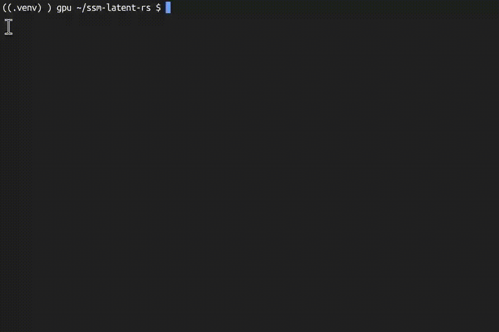
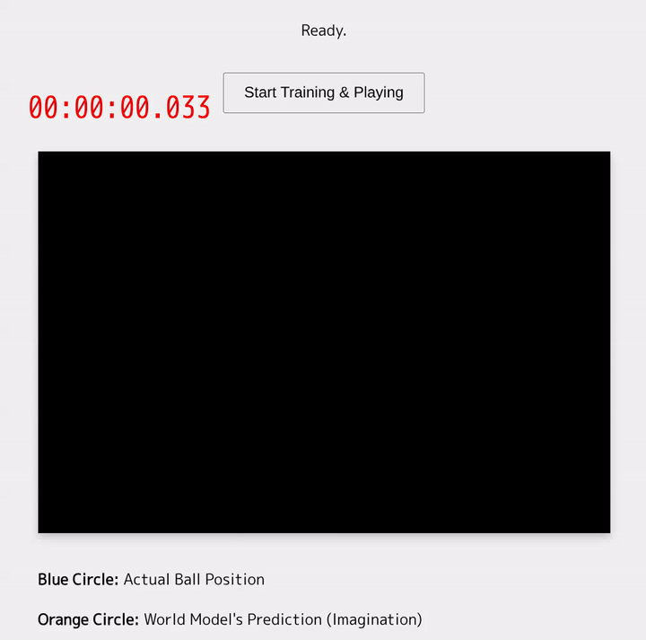

# SSM Latent World Model — Mamba-3 × JEPA

[](https://github.com/yosh95/ssm-latent-rs/actions/workflows/ci.yml)
[](https://github.com/yosh95/ssm-latent-rs/actions/workflows/security-audit.yml)
[](https://opensource.org/licenses/MIT)
[](https://www.rust-lang.org)
[](https://doi.org/10.5281/zenodo.20324811)

A Rust ([Burn](https://burn.dev/)) implementation of **Mamba-3** (Lahoti et al., ICLR 2026) integrated with **Joint-Embedding Predictive Architecture (JEPA)** for latent world modeling.



## 🔬 Key Finding: Multi-Scale SSM × JEPA Phase Locking

Circle-world is a deceptively simple test: predict (x, y) coordinates of a point
moving at constant angular velocity, 20 steps into the future.

| Configuration | 20-step prediction | Why? |
|---|---|---|
| **Mamba-only** (single-scale SSM, observation space) | ❌ Phase drift, converges to wrong quadrant | SSM models raw (x,y) directly — nonlinear circular dynamics exceed single-scale capacity |
| **JEPA-only** (single SSM + latent space) | ⚠️ Partial phase drift | Latent space helps, but single timescale cannot simultaneously track fast angular velocity and slow full-cycle period |
| **Multi-Scale SSM + JEPA** (this work) | ✅ Accurate phase-locked prediction | Three SSM layers (fast/medium/slow decay) decompose dynamics across frequency bands; JEPA's latent space lets SSM operate on the *essential representation* of the circle rather than raw coordinates |

**Neither component alone succeeds.  The two are structurally complementary.**

The multi-scale SSM stack initializes each layer with different decay ranges
(`a_re ∈ [-1.0, -0.3]`, `[-0.3, -0.05]`, `[-0.05, -0.005]`), enabling implicit
frequency decomposition without explicit Fourier features.  JEPA's encoder
projects observations into a latent space where the SSM predicts dynamics,
and the decoder maps back — the SSM never touches raw (x, y) during prediction.

This combination is, to our knowledge, **absent from the JEPA literature**
(all published JEPA models use Transformer backbones) and from the SSM
literature (SSMs are benchmarked on next-token prediction, not latent-space
world modeling).

### 🧬 Mamba-3: Three Core Innovations (all implemented)

| Innovation | Implementation | Mamba-3 Ref |
|---|---|---|
| **Exponential-Trapezoidal Discretization** | `λ_t`-gated 3-term recurrence: `h_t = α_t·h_{t-1} + β_t·B_{t-1}·x_{t-1} + γ_t·B_t·x_t` | Prop. 1, Eq. 5 |
| **Complex-Valued SSM** (data-dependent RoPE) | `a_re + i·a_im` with per-head rotation via `theta_proj` | Prop. 3–4 |
| **MIMO** (Multi-Input Multi-Output) | `mimo_rank` parameter; matmul state updates | §3.3 |
| **BCNorm** (QK normalization) | RMSNorm on B/C projections before bias addition | §3.4 |
| **B/C Biases** | Head-specific learnable biases; with exp-trap, makes short conv optional | §3.4, §4.2 |

---

## 🚀 Key Characteristics

- **Mamba-3 SSM Core**: Exponential-trapezoidal discretization, complex-valued state transitions (data-dependent RoPE), MIMO formulation, and BCNorm — all implemented in pure Rust/Burn. Short convolutions are **disabled by default** as exp-trap + B/C biases make them redundant (Mamba-3 §4.2).
- **Latent-Space Prediction (JEPA)**: Following the JEPA philosophy, the model predicts future states in a learned embedding space. This approach focuses on capturing essential dynamics rather than predicting every pixel, which helps in maintaining stability.
- **Collapse Prevention (LeJEPA / SIGReg)**: Implements *Sketched Isotropic Gaussian Regularization* (Balestriero & LeCun, 2025) — a **provably optimal** distribution-matching objective that constrains embeddings to an isotropic Gaussian.  SIGReg replaces the heuristics (stop-gradient, teacher-student, EMA schedule) with a single tunable hyperparameter, exactly matching the LeJEPA blueprint.  A lightweight moment-matching fallback (`stability_loss`) is also available for resource-constrained settings.
- **Multi-Scale SSM Stack**: Stacked SSM layers with different timescale initializations (fast/medium/slow) for capturing patterns across multiple temporal resolutions.
- **Trajectory Regularization**: Incorporates *Temporal Straightening* (Wang, Bounou, Zhou et al., 2026) to encourage locally linear, predictable latent trajectories, aiding long-term planning.
- **Cross-Platform Implementation**: Built with [Burn](https://burn.dev/), enabling the same model logic to run across different backends, including WGPU for browser-based WASM execution.

## 🕹 Demos & Usage

### WebAssembly Demos (In-Browser)
These experiments run locally in your browser, performing both training and inference.

- **Ball Catch Game**: A simple physics environment where the agent learns to intercept a ball.



**How to Run:**
1. Install [Trunk](https://trunkrs.dev/): `cargo install trunk`
2. Navigate to the desired demo (e.g., `cd game-playing-wasm`).
3. Start the local server: `trunk serve --release`

---

## 🧪 Technical Notes

- **Stability**: Uses random projections as a lightweight regularizer to prevent latent representation collapse. Two variants are provided:
  - `sigreg_loss`: Full **SIGReg** (LeJEPA) — characteristic-function matching against N(0,I), provably optimal and heuristics-free.
  - `stability_loss`: Moment-matching fallback (VICReg-style) for environments where the CF loop overhead is undesirable.
- **Complexity**: The implementation balances $O(L \log L)$ training complexity with $O(1)$ state updates during deployment.

### Running Tests

The project includes comprehensive tests covering core functionality, equivalence verification, and edge cases:

```bash
# Run all tests (including extended tests)
cargo test --all-targets --all-features

# Run specific test suites
cargo test --test core_tests          # Stability loss, curvature loss, save/load
cargo test --test equivalence_test    # Parallel scan ≡ sequential step equivalence
cargo test --test consistency_test     # Gradient computability
cargo test --test multimodal_tests   # Multimodal forward shape verification
cargo test --test extended_tests      # Edge cases, MIMO rank > 1, step(), vision, conv equivalence
```

#### Test Coverage

| Category | Tests | Description |
|---|---|---|
| **Equivalence** | Parallel vs. Sequential | Verifies `forward()` ≡ `forward_step()` loop |
| **Equivalence** | MIMO Rank 2 | Same equivalence test with `mimo_rank=2` |
| **Equivalence** | Conv1d enabled | Parallel/sequential equivalence with causal convolution |
| **Edge Cases** | `curvature_loss(seq_len < 3)` | Returns 0.0 for insufficient sequence length |
| **Edge Cases** | Constant velocity trajectory | Verifies curvature loss ≈ 0 for straight paths |
| **Step** | `LatentPredictor::step()` | Shape verification with/without conv |
| **Step** | Multi-step consistency | Finite outputs, evolving hidden state |
| **Vision** | Encoder/Decoder shapes | Round-trip shape preservation |
| **Vision** | Multimodal loss | Loss is finite and non-negative |
| **Gradient** | Conv1d gradients | Verifies conv weights receive gradients |
| **Gradient** | SSM parameters | Verifies `a_re`, `a_im`, `dt_proj`, `out_proj` gradients |
| **SIGReg** | Collapse prevention | Collapsed embeddings → higher loss than normal ones |
| **LeJEPA** | Combined loss | `lejepa_loss` is finite and non-negative |

## 📚 References

- Balestriero, R., & LeCun, Y. (2025). **LeJEPA: Provable and Scalable Self-Supervised Learning Without the Heuristics**. *arXiv:2511.08544*.
- Lahoti, A., et al. (2026). **Mamba-3: Improved Sequence Modeling using State Space Principles**.
- Maes, L., et al. (2026). **LeWorldModel: Stable End-to-End Joint-Embedding Predictive Architecture from Pixels**.
- Wang, Y., Bounou, O., Zhou, G., Balestriero, R., Rudner, T.G., LeCun, Y., & Ren, M. (2026). **Temporal Straightening for Latent Planning**.

## 📄 License
MIT License
