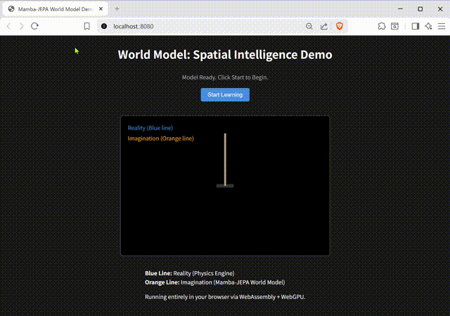

# ssm-latent-model

Rust implementation of a latent state predictor leveraging State Space Models (SSM).


## Features

- **SSM Dynamics**: Efficient sequence modeling using state space principles.
- **Latent Prediction**: Predicts future states in an embedding space.
- **Stability Regularizer**: Prevents representation collapse during training without contrastive samples.
- **Rust + Burn**: High-performance implementation supporting multiple backends (WGPU, NdArray, LibTorch, etc.).

## Installation

```bash
git clone <repository-url>
cd ssm-latent-model
cargo build
```

## Usage

### Native Demo
Run the command-line demonstration script:
```bash
cargo run --release
```

The native demo consists of three parts:
1.  **Observation**: Visualize the raw signal (a noisy circular motion).
2.  **Dreaming (Training)**: The model learns the underlying laws of the world. Every 20 epochs, it runs a "mental simulation" side-by-side with the ground truth to show how its understanding improves.
3.  **Pure Imagination**: The model predicts future states without any external observations, relying solely on its internal "World Model".

### WASM Metronome Demo

The metronome learning demo runs entirely in the browser using WebAssembly and [Trunk](https://trunkrs.dev/). **Training and prediction are performed locally in your browser.**



1. Install Trunk:
   ```bash
   cargo install trunk
   ```
2. Navigate to the demo directory:
   ```bash
   cd wasm-demo
   ```
3. Run the development server:
   ```bash
   trunk serve
   ```
4. Open your browser to `http://localhost:8080`.

The WASM demo consists of:
- **Blue Line**: Reality (The physics-driven ground truth).
- **Orange Line**: Imagination (The model's prediction).
- **In-Browser Training**: The model learns the metronome's dynamics in real-time within the browser. After about 100 epochs, the "Imagination" will sync smoothly with "Reality".

## Testing

Run equivalence tests (Parallel vs Sequential):
```bash
cargo test
```

## References

- Lahoti, A., Li, K. Y., Chen, B., Wang, C., Bick, A., Kolter, J. Z., Dao, T., & Gu, A. (2026). Mamba-3: Improved Sequence Modeling using State Space Principles. *arXiv preprint arXiv:2603.15569*. [https://arxiv.org/abs/2603.15569](https://arxiv.org/abs/2603.15569)
- Maes, L., Le Lidec, Q., Scieur, D., LeCun, Y., & Balestriero, R. (2026). LeWorldModel: Stable End-to-End Joint-Embedding Predictive Architecture from Pixels. *arXiv preprint arXiv:2603.19312*. [https://arxiv.org/abs/2603.19312](https://arxiv.org/abs/2603.19312)

## License

MIT License
