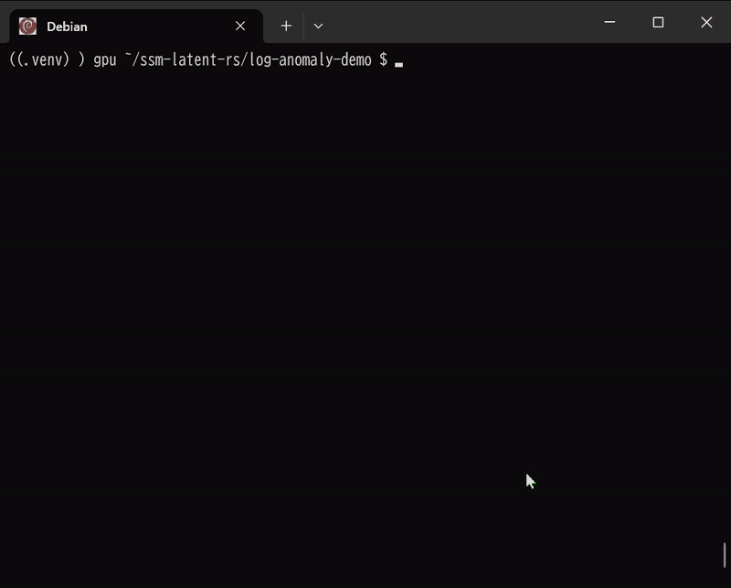

# ssm-latent-model

A Rust-based exploration of **Latent World Models**, drawing inspiration from recent advances in State Space Models (SSM) and Joint-Embedding Predictive Architecture (JEPA).


This project explores the integration of **Mamba-style** sequence modeling with the **JEPA** framework, aiming to build a lightweight yet robust system for future state prediction in latent space.

---

### 🎮 Ball Catch Game (WASM Demo)
*Learning physics through observation.* This demo showcases the model's ability to approximate object trajectories and react in real-time within a browser environment.


---

## 🚀 Key Characteristics

- **SSM-based Dynamics**: Utilizes State Space principles (inspired by the Mamba architecture) for efficient sequence handling, supporting both parallel training and fast, recurrent-style inference.
- **Latent-Space Prediction**: Following the JEPA philosophy, the model predicts future states in a learned embedding space. This approach focuses on capturing essential dynamics rather than predicting every pixel, which helps in maintaining stability.
- **Trajectory Regularization**: Incorporates concepts like *Temporal Straightening* to encourage more predictable and smoother transitions in the latent space, aiding long-term planning.
- **Cross-Platform Implementation**: Built with [Burn](https://burn.dev/), enabling the same model logic to run across different backends, including WGPU for browser-based WASM execution.

## 🕹 Demos & Usage

### 1. WebAssembly Demos (In-Browser)
These experiments run locally in your browser, performing both training and inference.


- **Ball Catch Game**: A simple physics environment where the agent learns to intercept a ball.
- **Metronome**: A task focused on synchronizing internal state with external periodic signals.

**How to Run:**
1. Install [Trunk](https://trunkrs.dev/): `cargo install trunk`
2. Navigate to the desired demo (e.g., `cd game-playing-wasm`).
3. Start the local server: `trunk serve --release`

### 2. Log Anomaly Detection
This demo showcases semantic anomaly detection in system logs. It combines **SentenceTransformer** embeddings with the **Latent SSM** to identify deviations from learned temporal patterns.
- **Hybrid Adaptive Thresholding**: Implements a robust anomaly detection engine using Median Absolute Deviation (MAD) for calibration and Exponential Weighted Moving Average (EWMA) online tracking.
- **Contamination Prevention**: Only normal observations update the threshold, ensuring the model remains resilient to persistent anomalies.

```bash
cargo run -p log-anomaly-demo --release
```


### 3. Native Latent Visualization
A CLI-based visualization of the model's "imagination" process.
```bash
cargo run --release
```

---

## 🔬 Other Experiments

### Deterministic AI Agent
A high-performance agent designed for industrial (OT) environments, focusing on reliability and determinacy.
- **Features**: Neural intent classification, Out-of-Distribution (OOD) detection via class centroids, and hybrid (Neural + Exact Match) Named Entity Recognition (NER).
- **Safety**: Designed to reject inputs falling outside the training distribution, ensuring predictable behavior in sensitive environments.
- **More Info**: See the [Agent README](deterministic-ai-agent-demo/README.md).

```bash
cargo run -p deterministic-ai-agent-demo --release
```

## 🧪 Technical Notes

- **Stability**: Uses random projections as a lightweight regularizer to prevent latent representation collapse in non-contrastive learning scenarios.
- **Complexity**: The implementation balances $O(L \log L)$ training complexity with $O(1)$ state updates during deployment.

### Running Tests

The project includes comprehensive tests covering core functionality, equivalence verification, and edge cases:

```bash
# Run all tests (including extended tests)
cargo test --all-targets --all-features

# Run specific test suites
cargo test --test core_tests          # Stability loss, curvature loss, save/load
cargo test --test equivalence_test    # Parallel scan ≡ sequential step equivalence
cargo test --test consistency_test     # Gradient computability
cargo test --test multimodal_tests   # Multimodal forward shape verification
cargo test --test extended_tests      # Edge cases, MIMO rank > 1, step(), vision, conv equivalence
```

#### Test Coverage

| Category | Tests | Description |
|---|---|---|
| **Equivalence** | Parallel vs. Sequential | Verifies `forward()` ≡ `forward_step()` loop |
| **Equivalence** | MIMO Rank 2 | Same equivalence test with `mimo_rank=2` |
| **Equivalence** | Conv1d enabled | Parallel/sequential equivalence with causal convolution |
| **Edge Cases** | `curvature_loss(seq_len < 3)` | Returns 0.0 for insufficient sequence length |
| **Edge Cases** | Constant velocity trajectory | Verifies curvature loss ≈ 0 for straight paths |
| **Step** | `LatentPredictor::step()` | Shape verification with/without conv |
| **Step** | Multi-step consistency | Finite outputs, evolving hidden state |
| **Vision** | Encoder/Decoder shapes | Round-trip shape preservation |
| **Vision** | Multimodal loss | Loss is finite and non-negative |
| **Gradient** | Conv1d gradients | Verifies conv weights receive gradients |
| **Gradient** | SSM parameters | Verifies `a_re`, `a_im`, `dt_proj`, `out_proj` gradients |

## 📚 References

- Lahoti, A., et al. (2026). **Mamba-3: Improved Sequence Modeling using State Space Principles**.
- Maes, L., et al. (2026). **LeWorldModel: Stable End-to-End Joint-Embedding Predictive Architecture from Pixels**.
- Wang, Y., Bounou, O., Zhou, G., Balestriero, R., Rudner, T.G., LeCun, Y., & Ren, M. (2026). **Temporal Straightening for Latent Planning**.

## 📄 License
MIT License
