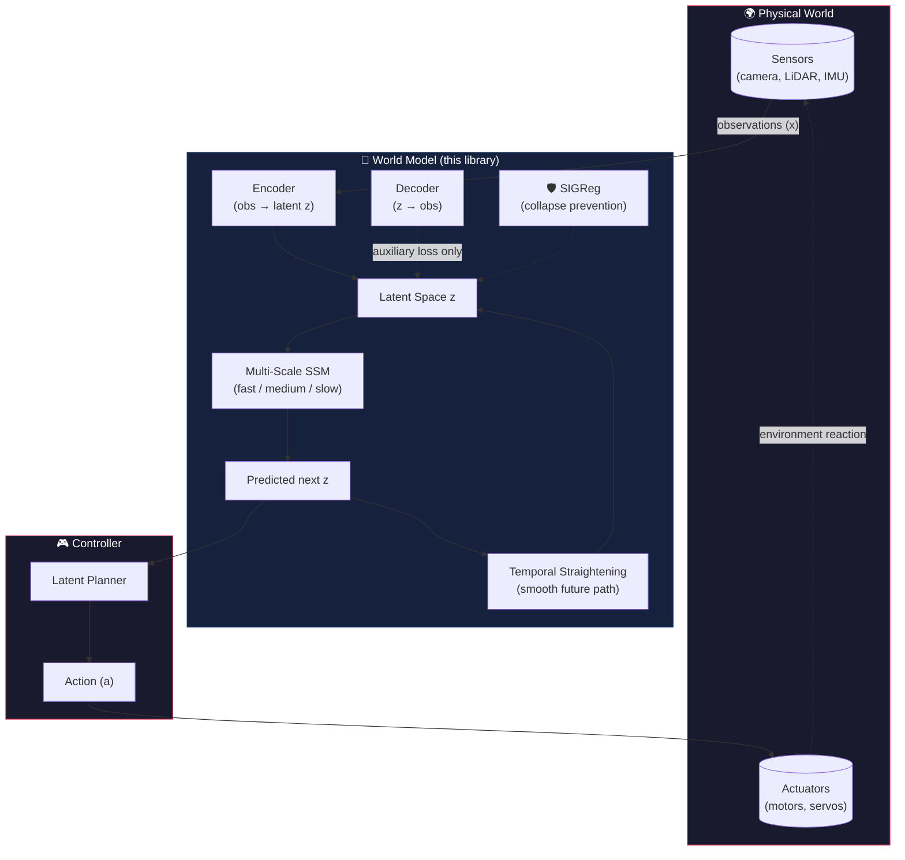
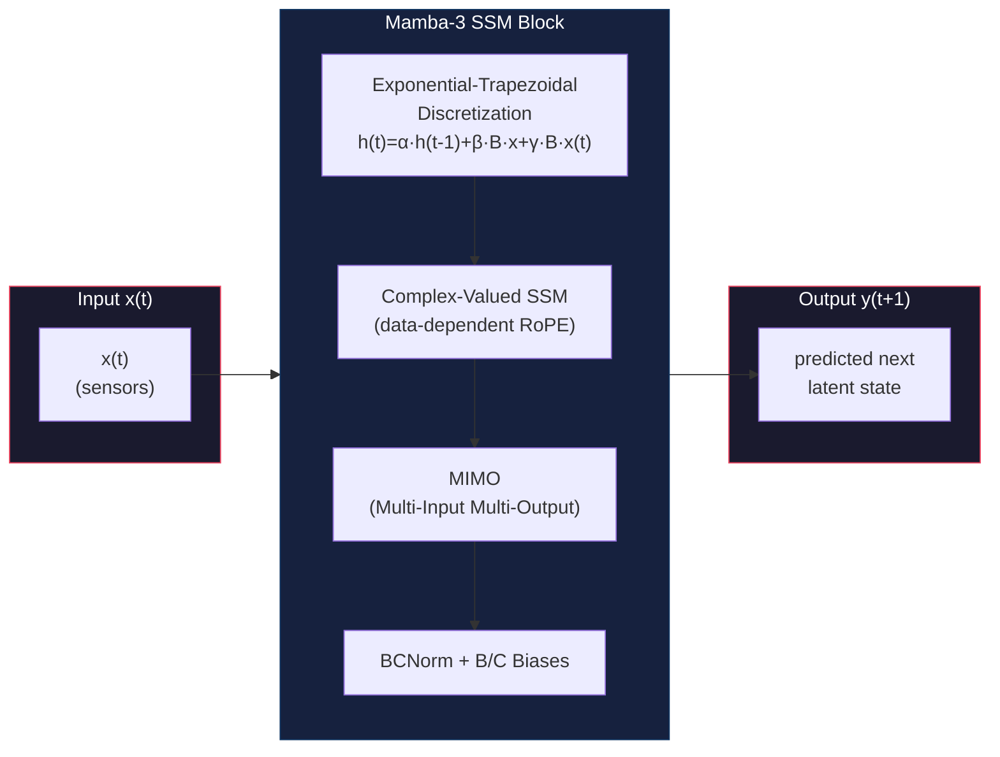
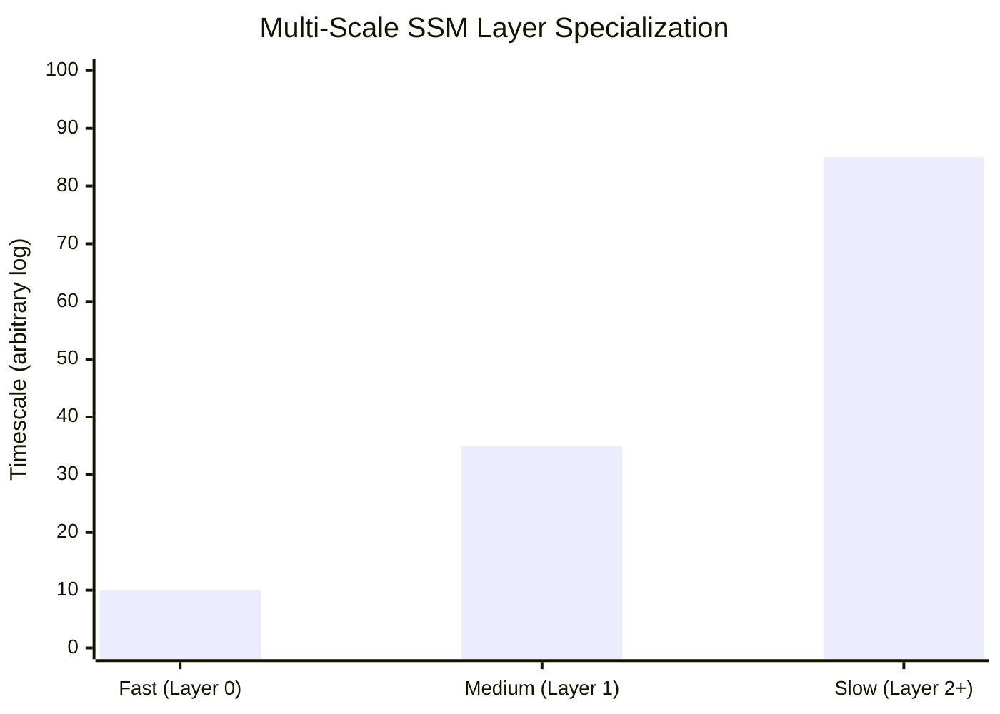

# SSM Latent World Model ⚡
### — Rust-based World Model for Physical AI (Mamba-3 × JEPA)

[](https://github.com/yosh95/ssm-latent-rs/actions/workflows/ci.yml)
[](https://github.com/yosh95/ssm-latent-rs/actions/workflows/security-audit.yml)
[](https://opensource.org/licenses/MIT)
[](https://www.rust-lang.org)
[](https://doi.org/10.5281/zenodo.20324812)

---

## 🌍 What is This?

**A next-generation World Model for Physical AI**, implemented in pure Rust.

This library combines **Mamba-3** (state-of-the-art State Space Model, ICLR 2026) with **JEPA** (Joint-Embedding Predictive Architecture by Yann LeCun's group) to create a **latent-space world model** that can:

- 🎯 **Predict future states** of physical systems in real time
- 🧠 **Learn compact representations** of complex dynamics (robotics, vehicles, sensors)
- ⚡ **Run on edge devices** — CPU, GPU, and embedded targets via Rust + Burn
- 🔄 **Plan actions** in latent space with temporal straightening

> **Why this matters for Physical AI:**  
> Autonomous robots, drones, and vehicles need an internal *world model* — a mental simulator that predicts "what happens next" from sensor streams. This library is that engine: efficient enough for real-time control, general enough for any physical domain.


*Latent world model accurately phase-locking a 20-step circular trajectory prediction — where Mamba-only and JEPA-only both fail.*

---

## 🔥 Key Insight: SSM + JEPA = Physical AI's Missing Piece

Current Physical AI architectures face a fundamental trade-off:

| Approach | Compute Cost | Real-Time? | Physical Understanding |
|----------|-------------|------------|----------------------|
| **Transformers** (NVIDIA Cosmos, etc.) | O(L²) | ❌ Too heavy for edge | ✅ Strong |
| **SSM alone** (Mamba, etc.) | O(L log L) | ✅ Lightweight | ❌ Can't capture multi-scale dynamics |
| **JEPA alone** (LeCun's LeWorldModel) | O(L²) | ❌ Transformer backbone | ⚠️ Partial |
| **SSM × JEPA (this work)** 🏆 | **O(L log L)** train, **O(1)** inference | ✅ **Edge-ready** | ✅ **Phase-locked prediction** |

**Neither SSM alone nor JEPA alone succeeds.** Their combination is structurally complementary:
- **JEPA's latent space** strips away pixel-level noise, letting the model focus on *essential dynamics*
- **Multi-scale SSM** decomposes physics across fast/medium/slow timescales (motor control ↔ path planning)
- Together they produce **accurate, phase-locked prediction** of physical trajectories

*This combination is, to our knowledge, absent from both the JEPA literature (all published JEPA models use Transformer backbones) and the SSM literature (SSMs are benchmarked on next-token prediction, not latent-space world modeling).*

---

## 🏗️ Architecture for Physical AI



| Component | Role in Physical AI | Implementation |
|-----------|-------------------|----------------|
| **Encoder** | Sensor fusion: camera → latent | `Linear` / `VisionEncoder` (Conv2d) |
| **Latent Space z** | Compact world state | Learned embedding, not raw pixels |
| **Multi-Scale SSM** | Physics dynamics engine | 3 layers: fast (motors) / medium (trajectory) / slow (environment) |
| **Temporal Straightening** | Action planning | Curvature loss → locally linear latent paths |
| **SIGReg** | Representation stability | Provable collapse prevention (Balestriero & LeCun) |
| **Decoder** | Observation reconstruction | Reconstruct for auxiliary loss only |

---

## 🧬 Implemented: Mamba-3 (ICLR 2026) — Full Spec

All three core innovations from Lahoti et al. are implemented in pure Rust/Burn:



| Innovation | What it does | Why it matters for Physical AI |
|-----------|-------------|-------------------------------|
| **Exponential-Trapezoidal Discretization** | λ-gated 3-term recurrence | More accurate integration of continuous physical dynamics |
| **Complex-Valued SSM** (data-dependent RoPE) | Complex state transitions with rotation | Captures oscillatory/physical phenomena naturally |
| **MIMO** (Multi-Input Multi-Output) | Matmul state updates | Parallel sensor stream processing |
| **BCNorm** | RMSNorm on B/C projections | Training stability for long-horizon prediction |
| **B/C Biases** | Learnable head-specific biases | Replaces need for short convolutions (§4.2) |

---

## 🎯 Physical AI Use Cases

Your project solves real problems in these Physical AI domains:

| Domain | Problem | How SSM × JEPA Helps |
|--------|---------|----------------------|
| 🤖 **Robot arm control** | Predict end-effector trajectory under varying load | Multi-scale SSM separates fast joint dynamics from slow drift. **→ Unlike Transformers, runs at control-loop frequency on edge** |
| 🚗 **Autonomous vehicles** | Predict surrounding vehicle motion | Latent space ignores irrelevant visual noise, focuses on essential kinematics |
| ✈️ **Drone navigation** | Real-time path planning in wind | Temporal Straightening ensures locally linear, predictable paths |
| 🏭 **Industrial anomaly detection** | Detect deviations from normal operation | `MambaPredictor` variant directly in observation space; `LatentPredictor` for complex sensor fusion |
| 🦾 **Humanoid locomotion** | Maintain balance under perturbation | Multi-timescale SSM tracks fast (foot placement) and slow (COM) dynamics simultaneously |

---

## 📊 Benchmark: Circle World (Physical Dynamics Prediction)

A deceptively simple physical test: predict (x, y) coordinates of a point moving at constant angular velocity, 20 steps into the future.

| Configuration | 20-step prediction | Root Cause |
|---|---|---|
| **Mamba-only** (single-scale SSM, observation space) | ❌ Phase drift → wrong quadrant | SSM models raw (x,y) directly — nonlinear circular dynamics exceed single-scale capacity |
| **JEPA-only** (single SSM + latent space) | ⚠️ Partial phase drift | Latent space helps, but single timescale cannot simultaneously track fast angular velocity and slow full-cycle period |
| **Multi-Scale SSM + JEPA** (this work) | ✅ **Accurate phase-locked prediction** | Three SSM layers (fast/medium/slow) decompose dynamics across frequency bands; JEPA's latent space strips coordinate nonlinearities |

The multi-scale SSM stack initializes each layer with different decay ranges:
- **Layer 0 (fast):** `a_re ∈ [-1.0, -0.3]` — rapid transients, motor-level dynamics
- **Layer 1 (medium):** `a_re ∈ [-0.3, -0.05]` — moderate decay, trajectory-level patterns
- **Layer 2+ (slow):** `a_re ∈ [-0.05, -0.005]` — very slow decay, environmental dynamics



---

## 🕹️ Demos

### Ball Catch Game (Physical Prediction in Browser)
A simple physics environment where the agent learns to intercept a ball — running entirely in your browser via WASM.


```bash
cargo install trunk
cd game-playing-wasm
trunk serve --release
```

### Circle World Demo (Native)
```bash
cargo run -p circle-world-demo --release
```

---

## ⚡ Performance Characteristics

| Metric | Value | Physical AI Implication |
|--------|-------|------------------------|
| **Training complexity** | O(L log L) | Fast training on sensor trajectories |
| **Inference step** | **O(1)** | Constant-time prediction — **control-loop ready** |
| **State update** | Single matrix multiply | Runs on Jetson, Raspberry Pi, any edge device |
| **Parameter count** | ~20K–100K | Tiny enough for embedded deployment |
| **Backends** | CPU (NdArray) / GPU (WGPU) / WASM | Train on GPU, deploy on edge |

---

## 🧪 Test Coverage

| Category | Tests | What It Verifies |
|----------|-------|------------------|
| **Equivalence** | Parallel vs. Sequential | `forward()` ≡ `forward_step()` loop — correctness for training & deployment |
| **Equivalence** | MIMO Rank 2 | Same, with multi-output formulation |
| **Equivalence** | Conv1d enabled | Causal convolution path consistency |
| **Edge Cases** | Short sequence, constant velocity | Graceful degradation, numerical stability |
| **Step** | Single & multi-step | Streaming inference correctness |
| **Vision** | Encoder/Decoder round-trip | Multimodal (camera + sensor) pipeline integrity |
| **Gradient** | All SSM parameters | Trainability of complex-valued, MIMO, and conv params |
| **SIGReg** | Collapse prevention | **Provable** representation stability (LeJEPA) |
| **LeJEPA** | Combined loss | Finite, non-negative, well-behaved optimization |

```bash
cargo test --all-targets --all-features
```

---

## 🔗 Comparison to Existing World Models

| Feature | NVIDIA Cosmos | LeWorldModel (LeCun) | **SSM Latent (this work)** 🏆 |
|---------|--------------|---------------------|---------------------------|
| **Backbone** | Transformer | Transformer | **Mamba-3 SSM** |
| **Computation** | O(L²) | O(L²) | **O(L log L) train / O(1) step** |
| **Latent prediction** | ✅ | ✅ | ✅ |
| **Multi-timescale** | ❌ (single) | ❌ (single) | **✅ Fast/Medium/Slow** |
| **Collapse prevention** | Contrastive | SIGReg | **SIGReg** |
| **Edge deployment** | ❌ (GPU cluster) | ❌ | **✅ CPU/GPU/WASM** |
| **Language** | Python/CUDA | Python | **Pure Rust** |
| **License** | Proprietary | Research | **MIT** |

---

## 🛤️ Roadmap

- [x] Mamba-3 full implementation (Exp-Trap, Complex MIMO, BCNorm)
- [x] JEPA latent predictor with encoder/decoder
- [x] SIGReg collapse prevention (LeJEPA)
- [x] Temporal Straightening for latent planning
- [x] Circle-world benchmark (phase-locked prediction)
- [x] WASM in-browser demos
- [x] Multimodal (vision + sensor + action) fusion
- [ ] Real robot integration (MuJoCo / Isaac Sim bridge)
- [ ] Sim-to-real transfer pipeline
- [ ] ROS 2 node for robotic control
- [ ] Pre-trained weights for common robotics tasks

---

## 📚 References

- Balestriero, R., & LeCun, Y. (2025). **LeJEPA: Provable and Scalable Self-Supervised Learning Without the Heuristics**. *arXiv:2511.08544*.
- Lahoti, A., et al. (2026). **Mamba-3: Improved Sequence Modeling using State Space Principles**. *ICLR 2026*.
- Maes, L., et al. (2026). **LeWorldModel: Stable End-to-End Joint-Embedding Predictive Architecture from Pixels**.
- Wang, Y., Bounou, O., Zhou, G., Balestriero, R., Rudner, T.G., LeCun, Y., & Ren, M. (2026). **Temporal Straightening for Latent Planning**.

---

## 📄 License

MIT License — free for commercial and academic use.

---

## 💬 Keywords

`physical-ai` `world-model` `mamba` `jepa` `state-space-model` `robot-learning` `embodied-ai` `latent-prediction` `temporal-straightening` `sigreg` `lejepa` `rust` `burn` `edge-ai` `real-time-control` `autonomous-systems`
